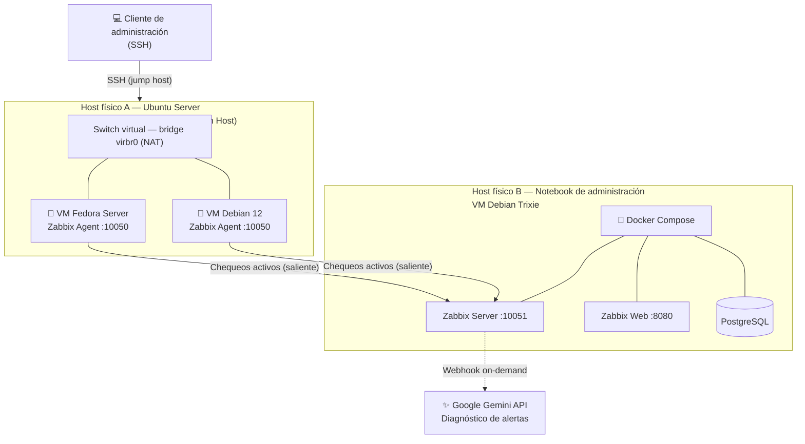

# Laboratorio-RedVirtualizada-Monitoreo
Laboratorio de virtualización con KVM/QEMU (Debian + Fedora) monitoreado con Zabbix dockerizado, acceso vía SSH Bastion Host y diagnóstico de alertas asistido por IA (Gemini).
# 🖧 Laboratorio de Red Virtualizada con KVM/QEMU y Monitoreo Centralizado con Zabbix

Laboratorio personal de virtualización y administración de sistemas: dos servidores Linux (Debian y Fedora) desplegados sobre KVM/QEMU, monitoreados de forma centralizada con **Zabbix** (dockerizado) y con una capa extra de **diagnóstico de alertas asistido por IA (Google Gemini)**.

Documentado como manual técnico paso a paso, incluyendo los incidentes reales del proceso y cómo se resolvieron — no solo lo que funcionó, sino también el camino para llegar ahí.

---

## 📑 Tabla de contenidos

- [Sobre este proyecto](#-sobre-este-proyecto)
- [Arquitectura](#-arquitectura)
- [Stack tecnológico](#-stack-tecnológico)
- [Qué incluye este laboratorio](#-qué-incluye-este-laboratorio)
- [Resumen rápido de despliegue](#-resumen-rápido-de-despliegue)
- [Troubleshooting destacado](#-troubleshooting-destacado)
- [Documentación completa](#-documentación-completa)
- [Próximos pasos](#-próximos-pasos)
- [Autor](#-autor)

---

## 🎯 Sobre este proyecto

Este repositorio documenta un laboratorio armado desde cero para practicar y consolidar conocimientos de **virtualización, administración de sistemas Linux (familia Debian y familia Red Hat), redes y monitoreo**, en el marco de mi formación como Analista de Sistemas y Técnico Jr. en Redes (CCNA 1-2-3).

La idea no fue solo "que funcione", sino simular un entorno real de infraestructura: separar roles (hipervisor, servidores monitoreados, servidor de monitoreo), asegurar el acceso remoto correctamente, y dejar todo documentado como si tuviera que entregárselo a otra persona del equipo.

## 📐 Arquitectura

- **Host físico A (Ubuntu Server):** hipervisor KVM/QEMU y *Bastion Host*: es el único punto de entrada SSH hacia las VMs internas.
- **VM Debian 12 / VM Fedora Server:** simulan dos servidores Linux de distinta familia, cada uno con Zabbix Agent.
- **Host físico B (notebook de administración):** corre el Zabbix Server dockerizado, que centraliza el monitoreo de ambos nodos.
- Las VMs viven detrás de NAT, por lo que el monitoreo se hace en **modo agente activo**: son ellas las que inician la conexión saliente hacia el servidor.

## 🧰 Stack tecnológico

| Categoría | Herramientas |
|---|---|
| Hipervisor | KVM, QEMU, libvirt, virt-manager |
| Sistemas operativos | Ubuntu Server (host), Debian 12, Fedora Server, Debian Trixie |
| Monitoreo | Zabbix Server, Zabbix Agent, Zabbix Web (nginx) |
| Contenedores | Docker, Docker Compose, PostgreSQL |
| Acceso remoto | SSH (arquitectura Bastion Host / ProxyJump) |
| Automatización / IA | Webhook en JavaScript + API de Google Gemini |
| Redes | firewalld, gestión de interfaces virtuales, NAT |

## ✨ Qué incluye este laboratorio

- 🖥️ **Virtualización con KVM/QEMU** sobre Ubuntu Server, con VMs Debian y Fedora corriendo en paralelo.
- 🔐 **Arquitectura de acceso Bastion Host**, sin exponer las VMs internas directamente a la red.
- 📊 **Monitoreo centralizado con Zabbix**, con el servidor dockerizado y los agentes nativos en cada nodo.
- 🤖 **Diagnóstico de alertas asistido por IA**: un webhook conecta Zabbix con la API de Google Gemini para sugerir causas y comandos de mitigación directamente desde la interfaz de Zabbix.
- 🩹 **Runbook de troubleshooting** con los incidentes reales del proyecto (no solo la teoría) y cómo se diagnosticaron y resolvieron.

## 🚀 Resumen rápido de despliegue

> 📄 La guía detallada, con cada comando y sus explicaciones, está en el [manual completo](#-documentación-completa). Este es solo el resumen de alto nivel.

1. Instalar KVM/QEMU + libvirt en el host Ubuntu y habilitar el usuario en los grupos `libvirt`/`kvm`.
2. Crear las VMs Debian 12 y Fedora Server con `virt-manager` sobre la red NAT por defecto.
3. Configurar el acceso SSH al host físico y, desde ahí, a cada VM (o en un solo salto con `ssh -J`).
4. Instalar `zabbix-agent` en ambas VMs y configurar `Server`, `ServerActive` y `Hostname`.
5. Levantar el stack de Zabbix Server con Docker Compose (PostgreSQL + Zabbix Server + Zabbix Web) en la notebook de administración.
6. Dar de alta ambos hosts en la interfaz web de Zabbix con el template **Linux by Zabbix agent active** y validar en *Monitoring → Latest data*.
7. (Opcional) Configurar el webhook de Zabbix + Gemini para diagnóstico de alertas on-demand.

## 🩺 Troubleshooting destacado

Algunos de los problemas reales que aparecieron durante el armado del laboratorio, documentados en detalle en el manual:

- La ruta del archivo de configuración de Zabbix Agent **no es la misma en Debian que en Fedora** — se diagnosticó con `systemctl cat zabbix-agent` en lugar de asumir la ruta "de manual".
- Rechazo silencioso de métricas por un `Hostname` que no coincidía exactamente (mayúsculas incluidas) entre el agente y la web de Zabbix.
- El ícono de disponibilidad de un host puede quedar en gris con el monitoreo funcionando perfectamente — hay que validar por datos reales (*Latest data*), no por el ícono.
- Error `400 - API key not valid` en la integración con Gemini, resuelto validando cada clave directamente contra la API antes de cargarla en Zabbix.

## 📄 Documentación completa

El manual técnico completo — con cada comando, cada decisión de diseño explicada y el runbook completo de troubleshooting — está disponible en:
Manual_Laboratorio_KVM_Zabbix.pdf

## 🗺️ Próximos pasos

- [ ] Migrar el acceso SSH a autenticación por llave pública/privada, eliminando contraseñas interactivas.
- [ ] Automatizar con Bash los respaldos periódicos de las configuraciones críticas.
- [ ] Evaluar la migración a Zabbix Agent 2 para reporte de disponibilidad también en modo activo.

## 👤 Autor

**STEFANIA ELIANA RANDAZZO** — Estudiante de Analista de Sistemas · Técnico Jr. en Redes (CCNA 1-2-3) · DevOps

linkedin.com/in/stefania-eliana-randazzo ·github.com/StefRanda· stefania_eliana_randazzo@live.com.ar

---

Proyecto de laboratorio personal con fines educativos y de práctica profesional. No representa infraestructura de producción.
